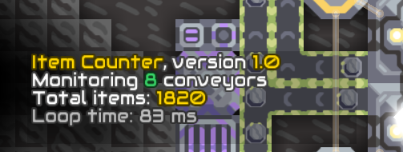

# Graphs

This directory contains a collection of schematics oriented at measuring and displaying various quantities

## Item Counter

The item counter (and a smaller, microprocessor-based variant) is capable of counting items being loaded onto a plastanium conveyor. The loading spots of the plastanium conveyors to be monitored must be linked to the processor. The processor detects new batches being formed and updates a running total of items detected.

The standard Item Counter can handle up to 16 conveyors at once, Item Counter Micro can handle up to 4 plastanium conveyors without missing a batch being created, under these conditions:

1. The game runs at 60 FPS or higher.
2. If the processor is boosted to the same level as the plastanium conveyors by overdrive projectors or domes, the conveyors can be fed at the maximum possible speed (i.e. by feeding them from several directions and/or using bridges to increase item supply).
3. If the processor isn't boosted, but the plastanium conveyors are (up to 250%), the item Counter is guaranteed to work as long as each plastanium conveyor is fed at a rate of 10 items/sec. This means the conveyors are fed from a single source (a factory, an unloader or a conveyor; when fed from a bridge, the bridges must not be chained to increase the flow rate).
4. The plastanium conveyors must not be fed directly from other plastanium conveyors (e.g. by placing loading and unloading spot next to each other). In these situations, the whole batch gets transferred instantaneously and the processor can't detect them.

The total amount of items is displayed in the message block.

The Item Counter micro comes with a built-in memory. The Item Counter needs a separate external memory to write the running total to. Other schematics in this directory are capable of computing and graphing the flow rate from these values.

Linking or unlinking blocks to/from the processor causes the processor to reinitialize and rescan linked blocks, potentially missing some items that were sent during the reinitialization. Pressing the switch reinitializes the processor and also resets the total.

Linked blocks which are unsupported are ignored, and they do not slow down the processor. When linking more than the supported number of plastanium conveyors, the processor gets stuck at reinitialization until the problem is corrected. The processor doesn't detect when a plastanium conveyor is linked incorrectly (that is by a segment different from their loading spot).

To count items in the middle of a plastanium belt, the flow must be interrupted by different kind of transport, such as bridges or titanium conveyors:

