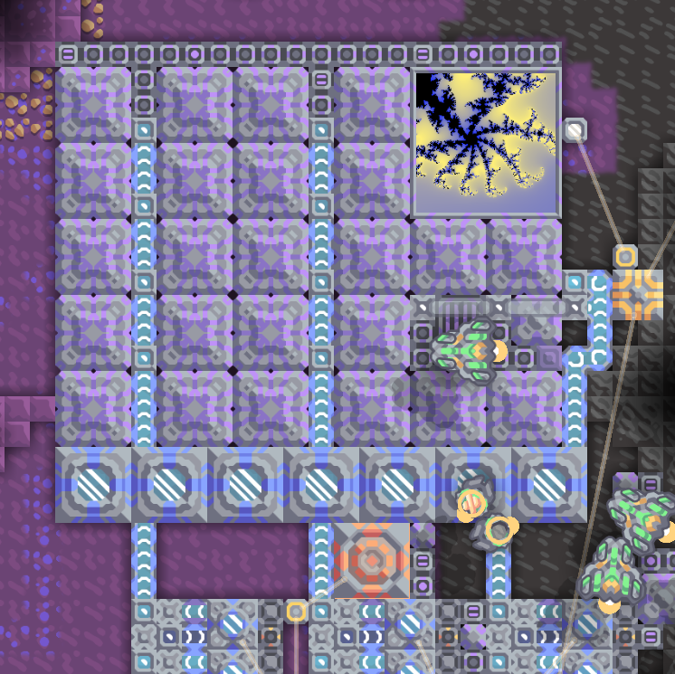

# Mandelbrot

> [!NOTE]
> This schematic uses the atomic code blocks introduced in Mindcode 3.13, and requires the latest BE version of Mindustry (build 26609 or higher). The latest beta release (v154.3) doesn't provide necessary support for atomic code blocks, and the computation will be wrong.

A schematic displaying the Mandelbrot-set based fractal in a display. Computed in parallel using 24 hyper-processors.

Allows navigation inside the picture (movement along the x/y axes, zoom in, zoom out), switching to the Julia set corresponding to the point in the center of the display, bookmarks for storing/loading positions, and five different coloring schemes.

Since Mindustry doesn't redraw displays which aren't shown on the screen and the graphic buffer may easily overflow, calculations are paused while the display is out of view.

Given enough resources, can be built and used in survival (outside the sandbox). Using an overdrive dome, which is not included in the schematics, is essential.
