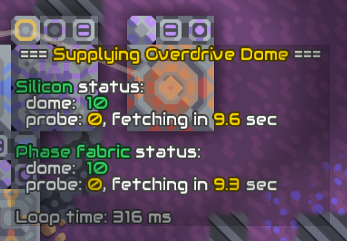

# Overdrive Dome Supply

Uses units to supply the dome with silicon and phase fabric from the core. The preferred unit type can be set in the `UNIT_TYPE` variable at the beginning of the processor code. If units of this type are not available, the processor tries to use `@flare`, `@poly`, `@mega` or `@mono` (in this order) until a suitable unit is found.

Once the preferred unit becomes available, the processor switches to that unit.

If units used by the processor are lost (either stolen by another processor or by player, or destroyed), the program is restarted and new units, possibly of different type again, are acquired.

If the type of servicing units is too slow to travel back and forth before the overdrive dome consumes all its items, two pairs of units are used to ensure continuous operation.

Use switch to activate/deactivate supply.
