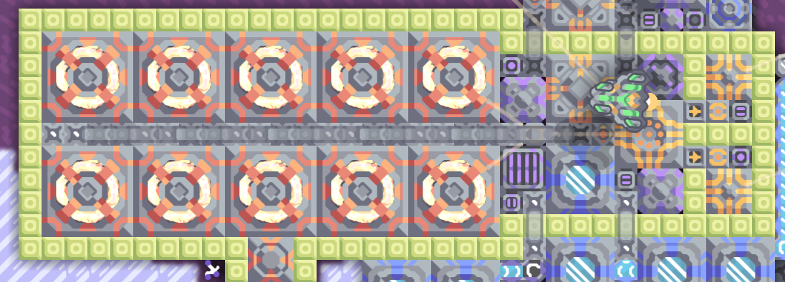

# Impact Reactor Power Plant

> [!NOTE]
> The Power Plant source codes haven't been updated to the new `strict` syntax of Mindcode 3.0. It still compiles, but the code could be improved in various ways.

> ![TIP] 
> To start up, the battery must be charged. The schematic contains a processor which brings thorium from the core using units to charge the internal battery for the fist start. Also, fuel and cryofluid must be available. 

The power plant has three modes of operation:

* **Shutdown**: all reactors, overdrives and power outputs are disabled.
  * RTG generator is enabled if the net power isn't negative and battery isn't saturated
  * When `switch1` is activated, the STARTUP mode is entered
 
* **Startup**: RCP is bringing reactors online
  * RTG generator is activated
  * First reactor isn't started until enough power is stored in batteries
  * After the first reactor is started and net power is positive, the overdrive is activated
  * Just enough reactors are started to power up first power output (presumably a coolant/fuel factory)
  * After the first output is powered, the rest of reactors are brought online
  * When all reactors are online and second output is powered, running mode is entered
  * When `switch1` is deactivated, **Shutdown** mode is entered

* **Running**: reactors and overdrives are kept running with possible load adapting
  * If coolant or fuel fall below critical levels, **Shutdown** mode is entered and `switch1` is deactivated
  * When `switch1` is deactivated, SHUTDOWN mode is entered
  * If `switch2` is active and available battery capacity is greater than 100K * number of reactors, load adapting is performed:
    * decommitting:
      * possible if battery is saturated and battery balance is not negative
      * if overdrive is active, it is deactivated
      * if overdrive is not active, one reactor is shut down
      * decommit cool-down period is started
  * committing: if required remaining capacity (50% if overdrive is active, 20% if it is inactive) is not met, or battery storage falls faster than PANIC_ENERGY_DROP per second: everything is started at once (overdrive and all reactors)

The following controls must be statically linked to the main processor:

* `diode1`: diode controlling the first surge tower output (to the support factory for producing coolant and perhaps fuel)
* `diode2`: diode controlling the second surge tower output (to the rest of the grid / weapons)
* `battery1`: the internal battery, contains the start-up energy
* `battery2`: battery of the first output (behind `diode1`)
* `battery3`: battery of the second output (behind `diode2`)
* `switch1`: control switch. Activating it initiates the startup sequence. Deactivating shuts down reactors.
* `switch2`: load adapting switch. When active, reactors are started and stopped according to power demands
* `message1`: status messages
* `generator1`: RTG generator providing energy when reactors are offline
* `cell1`: memory cell containing last state of the processor
* `bank1`: memory bank containing the values monitored by the standalone processor
* `tank1`: coolant tank
* `vault1`: fuel tank

Additionally, these types of blocks can be dynamically linked and are used in this way:
* Impact reactors: at least one must be linked. Impact reactors are controlled by the main processor.
* Overdrive projectors/domes: controlled to provide boosts when appropriate. All of them are activated/deactivated at the same time.
* Conduits of any kind: linked conduits are disabled unless the power plant is starting. It can be used to allow in-flow of cryofluid from reserve storage during startup.
* Conveyors of any kind: linked conveyors are disabled unless the power plant is starting. It can be used to allow in-flow of fuel from reserve storage during startup.

Two large batteries per reactor should be linked to the internal battery, perhaps by using a surge tower.

Nothing else must be attached to those batteries - use plastanium walls to prevent accidental connections.
