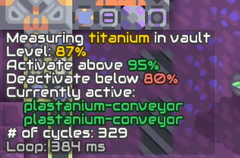

# Production & consumption

This directory contains a collection of schematics oriented at production and consumption management.

## Regulator

Regulates production or consumption by switching linked blocks on or off depending on the amount of items/liquids/power available. Contains two parameters: `PCT_LOW` and `PCT_HIGH`. When the storage is filled up to `PCT_HIGH` or more, the linked blocks are deactivated. When the storage is filled up to `PCT_LOW` or less, the linked blocks are activated. This mode of operation is suitable to switching off production when the materials are not needed.

Linking an inverted sorter (regardless of its configuration) inverts the activation logic: linked blocks are activated when the level is high and deactivated when it is low. This mode of operation is suitable for regulating demand, e.g. for siphoning off excess production to be sent to the core.

Linked blocks are scanned during initialization and used according to their type as follows:
 
* Messages are printed to the first message block found.
* Reset switch is the first switch block found. Reset causes complete reconfiguration (new scanning of all linked blocks).
* Unloader, sorter or inverted sorter, if configured, is used to specify item to measure in item containers.
* The first linked container/liquid-tank/battery/power node/surge tower is used for level measurement:
  * Container, vault or core: if an unloader, sorter or inverted sorter is linked, measures the amount of items selected in the given block. If no such block is linked, or if no item is configured in the block, total items are measured. If the container contains more than one type of items, it is necessary so configure a specific item to measure for proper function.
  * Liquid tank, container or router: measures total liquids.
  * Battery: measures total power (`@totalPower`) stored in the battery.
  * Power node or surge tower: measures total net power (`@totalNetPower`) stored in all batteries in the grid.

All blocks that are linked after the measured block are enabled/disabled according to the fill level of the block. This includes sorters, inverted sorters or unloaders, even if they're used to configure the item to measure. Pay attention to the order in which you link blocks to the processor.

Number of cycles displayed in the message block corresponds to the amount of times the production has been switched on or off since last initialization.

Linking/unlinking blocks, or destroying some of the linked blocks, causes a reinitialization.   