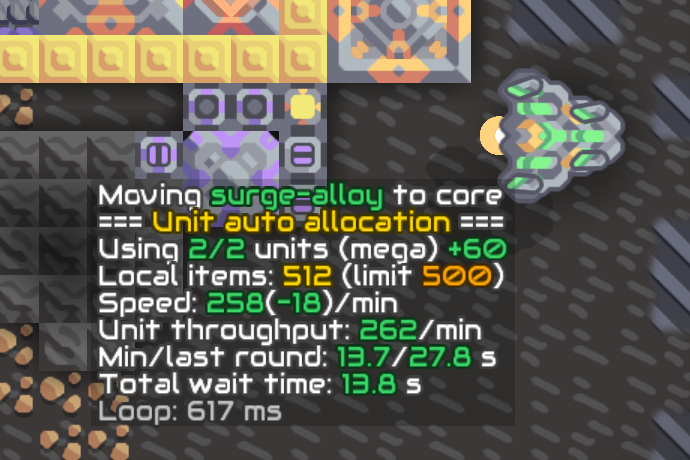

# Unit Transport



This is yet another implementation of units controlled by Mindustry logic to transport items, one that is automatic, self-correcting, highly configurable and providing detailed status information.

> [!NOTE]
> The Unit Transport source code hasn't been updated to the new `strict` syntax of Mindcode 3.0. This will be done, together with rewriting the unit handling mechanism, when internal arrays ("counter arrays") get implemented in Mindcode.     

## How to use

- Build the schematic.
- On the first line of the processor code, set the unit type to use (the "set UNIT" command; you have to type in the unit type manually as it is not a `ubind` command). See [supported units](#additional-configuration) below.
- The schematic moves items from core to the local container/vault. If you want to transport items in the other direction, build an inverted sorter in place of the regular sorter that comes with the schematics.
- If you want to use a remote vault instead of the core, build the `Remote Vault` schematic and set the `LINK_ID` variable to the same value in both processors.
- Link the storage (a container or a vault) to the processor.
- Select type of transported items in the sorter/inverted sorter.

That's all! The processor starts using units on its own and allocates as many units as needed to adjust to the item consumption/production rate. If the units are not built yet, the processor will wait for them to appear. You can change any of the settings above anytime (including replacing the sorter with inverted sorter or vice versa) -- changes will be reflected and the processor will reinitialize if needed. If something needs your attention, it should be mentioned in the linked `message1` block.

By default, the processor starts in automatic unit allocation mode. You can switch to manual mode by pressing one of the switches. The corner switch increases number of used units by one, and the middle switch decreases it by one. Decreasing it to 0 stops unit activity. Pressing the middle switch again when the number of units is zero returns the unit allocation to the automatic mode.

## Multiple destination vaults

When you're transporting items from the remote vault or core to the local container, you can link more than one container or vault. The processor then chooses a container with the lowest level of the item being transported and moves the items into it. When the container fills up, the processor switches to another container containing the lowest number of items.

Do not link both containers and vaults at the same time -- the containers could be selected as a destination even when full, because they may still contain fewer items than a half-empty vault.

This can be useful when the items aren't being consumed at a steady rate, for example when transporting ammo. When items from all containers or vaults are being steadily consumed, the processor won't compensate by allocating more units, as it always only considers the flow rate in the single vault/container being served.

## Unit management

The processor maintains a value corresponding to a number of units it intends to use (a `target`). In manual mode, the user sets the target, while in automatic mode, the target is adjusted by the processor to meet the needs of the actual flow rate between the local and remote locations. When the demand to move items is higher than can be provided by the current target, the target is increased; when the demand is lower, the target is decreased.

The processor acquires or releases units to meet the target. If some of the active units are lost (killed, taken over by the player or "stolen" by another processor), free ones are acquired to compensate. When there are no free units available momentarily, the processor keeps trying to acquire them until it succeeds.

Freshly units that hold some items are sent to the core first to drop those items. Units no longer in acquired use are moved to the core (or the remote location) and items they kept are also dumped there. Then they're parked on the side of the core opposite to the unit path to keep them out of the way.

This is probably is all that you need to know. More details will be described below.

## Additional configuration

Some features have to be configured by changing variable assignments at the beginning of the code:

- `UNIT`: as mentioned before, this determines the type of unit to use. This is not a `ubind` command, so you need to type in the correct unit type by hand. Possible values are: `@mono`, `@poly`, `@mega`, `@quad`, `@oct`, `@flare`, `@horizon`, `@zenith`, `@antumbra`, `@eclipse`. (No, I don't really expect you to use eclipses for item transport, but if you want, you can.)
- `LINK_ID`: numerical ID between `0` and `99`. `0` means the remote location is a core, other values denote a concrete remote vault assigned the same ID. Build the `Remote Vault` schematics and enter the same `LINK_ID` in its microprocessor. The unit transport processor will then locate the remote vault automatically, although it might take several seconds to do so. Note that changes to the remote vault IDs aren't reflected by processors already using them.
- `AUTO_ALLOCATION`: `true` or `false`. When `true`, the processor starts in automatic unit allocation mode.
- `MAX_UNITS`: how many units to use at most. Can be handy to prevent the auto allocation mode from using too many units, but the value limits both auto and manual modes.
- `HOUSEKEEPING`: `true` or `false`. When `true`, the processor assumes you're using a dedicated housekeeping processor to collect units that are no longer in use and marks deactivated units with a nonzero flag. If you set it to `true` and don't have housekeeping processor, all that happens is that units are left hanging around with nonzero flags. Processors that depend on the inactive units having a zero flag might have hard time finding free units.
- `DROP_TO_AIR`: `true` or `false`. When `true`, any unwanted items held by freshly acquired unit are discarded. When `false`, the processor tries to return these items to the core instead. If the remote location is a vault and not a core, the items are discarded and not returned to the core in any case.
- `LOCAL_LIMIT`: numerical value between `20` and `100`. Determines the percentage of capacity of the local container to use; the rest is ignored. If you set the value to `80` while using a local vault, the processor will behave as if the vault had a capacity of 800 instead of 1000: it won't fill it up to more than 800, or drain it to less than 200. Useful if you're moving items to/from a container that is also fed/drained by drills or factories -- if the units filled or drained it completely, the drills/factories might get bogged down or starved.
- `REMOTE_LIMIT`: the same as `LOCAL_LIMIT`, except for the remote location. Can be also handy if you take some material from the core, but want to always keep something there so that you can use the material to build things.
- `OVERALLOCATION_LOW`, `OVERALLOCATION_HIGH`: in auto allocation mode, the processor allocates units according to demand. To avoid high fluctuation of the number of active units, there's an insensitivity zone in which no new units are acquired or released, determined by these low and high boundaries. I don't recommend changing the low boundary, but you can increase the high boundary to help stabilize the number of units used (at the price of keeping more units than strictly necessary), or decrease it to free more units (and risk higher fluctuation as a result).
- `STABILIZATION`: when set to `true`, an average from last three recorded values of flow rate is computed and used in automatic unit allocation algorithm. Setting it to true can help lessen fluctuations of the number of active units in case the natural flow rate of the items itself is not steady.

## Displayed information

The schematic comes with two message blocks that show comprehensive information about the status. Here is an example of the first message block output:

```
Moving titanium from vault #2
=== Unit auto allocation ===
Using 1/1 units (mega) +0
Local items: 592 (limit 600)
Remote items: 793
Speed: 122(+61)/min
Unit throughput: 203/min
Min/last round: 17.6/29.4 s
Total wait time: 10.5 s
Loop: 601 ms
```

Some values are only shown in automatic unit allocation mode. Most of it is, hopefully, self-explanatory. We'll explain some of the less obvious ones:

- `Using` line specifies the number of active units before the slash and current target after the slash. The first number can be higher -- the processor is going to free some units, or lower -- the processor is trying to acquire more units. Number after the plus sign says how many items are held by active units (these items are already on their way to the destination, or "in transit").
- `Local/remote items` shows the levels in both local and remote container and, if there's a `LOCAL_LIMIT`/`REMOTE_LIMIT` in place, shows the actual value of the limit as applied to the container.
- `Speed` shows the current flow rate in items per minute. This value is measured by the processor and might be somewhat imprecise, but in the average, it lies in the general ballpark of the real value. The number in parentheses, if present, shows the correction obtained from monitoring the local container level. Adding these two numbers together yields the estimate of a flow rate the units need to provide to keep the container level steady.
- `Unit throughput` shows predicted throughput of a single unit. This value is not measured, but computed using the unit capacity, unit speed and transport distance.
- `Min round` is computed theoretical minimal duration for a unit to complete one cycle (or "turnaround").
- `Last round` is the duration of the last completed turnaround. This value can be higher than the minimal round if the units had to wait for items to be loaded/dropped at the source/destination, or if there were some obstructions on the way. If there's lots of wait time, last round time won't be measured correctly and lower values can appear.
- `Total wait time` is the total time units spent waiting for a resource (either at local or remote container). Wait times higher than the minimal/last round time indicate there are more active units than strictly necessary (they may still be kept around in automatic mode as a result of overallocation).
- `Loop` is the time it takes to service all units. See the notes on processor speed below. (The processor which produced this output was boosted to 150%.)

Sometimes additional information can be shown, for example "Cannot acquire additional units". When this happens, the length limit of the message block might be exceeded and some information might not be visible.

Second message block contains information about individual active units: what direction they're travelling, how long it will take to reach the target, and how many items they're holding. If there are many active units, the output will be truncated.

## More details on automatic unit allocation

The automatic unit allocation measures and uses three criteria: wait times, flow rate and number of items stored in container/vault (container level).

Wait times occur when a unit is at the position to take or drop items, but there aren't enough items in the storage, or the storage is too full. When this situation is detected (either on the local or the remote side), the wait time is increased accordingly. If the wait time is not zero, the target (number of units the processor wants to use) is never increased -- if there's any wait time at all, additional units won't have anything to do. If the total wait time exceeds the turnaround time plus some overhead, the target is decreased by one. (Note that if the turnaround time is 30 seconds and there are ten units waiting for items that aren't available, the 30 seconds of wait time accumulates in mere 3 seconds of real time. The more superfluous units are there, the faster they'll get discarded.)

Wait time is the only value measured on both sides of the transport route -- both locally and remotely. This way the number of active units gets adjusted to actual demand, even if the demand is driven by the remote side. It will necessarily be less precise, though.

Flow rate is important factor for getting the right number of units for the job. The processor measures the actual flow rate by measuring the time it takes for all active units to complete the cycle and counting the items they've delivered. On top of that, the changes of the container level are recorded and the values are used to adjust the flow rate. Let's say that there's a full container with a factory which consumes 30 items/min, serviced by a single unit capable of transferring 60 items/min. Then you expand the factory significantly to consume 300 items/min (given these numbers, we can see that we'd need at least five units to keep up with the new level of consumption). Upon completing the first turnaround, the computer will see that the actual flow rate provided by the unit has risen somewhat, perhaps to 60/min, and might acquire an additional unit, as it always allocates a little bit more than needed. As it also monitors the container level, it can see that in the 20 seconds it took to deliver the items the level of the container has fallen by 80 (there were 100 items consumed and 20 new ones brought by the unit), and the real demand is therefore 300/min. It will therefore allocate five more units right off the bat (five, not four, because of the overallocation mentioned before).

Flow rate computation is difficult and rather imprecise, especially after the number of active unit changes, but it works pretty well for our purposes. Furthermore, the computed flow rate is never used to decrease the number of active units, only for increases, which also helps to lessen instability.

The last factor coming into acquiring new units is the container level getting too low (or free space getting too low in case of transporting items from the local container). If the container level/free space drops below 10%, the number of required units computed from the flow rate is increased by two.

## Add-ons

\[Not yet implemented\]

If you link a repair point to the processor, arriving damaged units will be moved there and kept there until their health is fully restored -- can be useful if the transport path is close to enemy territory. Place several repair points together to heal units faster (it's enough to link just one of them to the processor). Also make sure they have enough power to function, otherwise the units will get stuck there!

## Processor speed

The speed of the processor can have quite an impact on the performance of the unit transport. While units on their way between a local and remote location don't need much supervision, they need to be handled very quickly when they arrive at the container. Mindustry logic doesn't provide a way to command a handful of selected units; if you want to control more than one of them, you need to iterate through all the existing units. At the basic speed of the logic processor, it takes about 900 ms plus 30 to 60 ms per active unit to complete one such loop, assuming there are 24 units in total. During this loop all units are visited, and the active ones are issued commands as necessary. If a unit arrives at the container just a moment after it was processed by the processor, it has to wait the whole loop -- about a second for a handful of active units -- before it gets issued a new command.

A lot of care was put into minimizing the number of loops wasted on units. When a unit that has just arrived at a point is handled, its payload is dropped or loaded and the unit is sent again on the way, typically without wasting a single loop.

There's a lot more happening in each loop apart from handling units: the configuration and state of the buildings are checked, statistics are computed and displayed and, in the automatic unit allocation mode, additional computations are made to adjust the number of employed units.

The logic processor's speed is just about sufficient. If you have an overdrive projector or dome nearby, it is certainly a good idea to place the processor in its range. Using (overdriven) hyperprocessor would be even better, but may not be worth the cryofluid hassle. My tests have shown that using 250% boosted hyperprocessor can increase the transport speed by 5 to 30%, depending on the exact distance travelled by the units (for longer distances the speed benefit gets smaller). The value of the speedup depends on exact timings of various events, and increasing the processor speed by some value doesn't mean the transport speed will increase proportionally.

## Additional notes and considerations

- When using a container and not a vault, it's better to use units with lower item capacity -- `@flare`, `@horizon`, `@mono` or `@poly`. Larger units have item capacity that is a significant fraction of the container capacity and that makes automatic unit allocation less stable.
- Number of units used in the automatic unit allocation mode might fluctuate a bit, but if the inflow/outflow rate to/from the local container is steady, it should eventually stabilize at a suitable level and perhaps release and then reacquire at most a single unit eventually (increasing the `OVERALLOCATION_HIGH` value can help with this). If the container item flow isn't quite steady, however, the number of active units can fluctuate a lot, even if the average flow rate is consistent over longer periods of time. The reason is that it is quite difficult and computationally intensive to obtain average flow rate over longer periods of time in Mindustry logic.
- Larger units (antumbras, for example) blocking the path between containers can interfere with the flow rate and cause the automatic unit allocation to perform poorly.
- When moving items between two vaults in automatic mode, place the **Unit Transport** schematics on the side which exhibits more variations in production/consumption rate. If you ship titanium to an exponential reconstructor from a drill site, the drills will produce items at a constant rate, while the reconstructor will consume large quantities of titanium whenever it starts building a new unit, and stop consuming it once it fills up. Place the remote vault at the drills and the transport processor at the reconstructor.
- Remote vaults can be used as local vaults by another unit transport processor. This allows to create transport paths that are not straight. Probably the only practical reason could be to avoid contested space, as the straight path would be always faster and use less units. In this case, it might be advisable to lower the value of
  `LOCAL_LIMIT` of the processor(s) whose local vault is a remote vault for someone else.
- When loading a saved game, the state of the processor is completely preserved, but units that were previously controlled are lost (we use the `@unit.controlled` and `@unit.controller` attributes, not the unit flag, to track controlled units, and these attributes are not preserved). The target value is preserved, however, and the processor will automatically acquire new units after loading a game.
- When `HOUSEKEEPING` is set to `false`, or a housekeeping processor is actually active, this implementation is fully compatible with processors that use flags to track controlled units, assuming they issue commands to their units periodically. If they mark their units with flags, but leave them idle for prolonged periods of time, this implementation will consider those units as free to use.
- Automatic unit allocation sometimes depends on the local container filing up completely (or emptying down completely in case of container unloading) to detect more units might be needed. If something prevents this from happening, additional units might not be allocated even though adding some would increase the flow rate. Practically it only happens when the local container inflow/outflow is controlled by another processor. The easiest way to achieve this (but why?) is to set up two transports, one for each direction.

## Derived schematics

There are also some simplified unit transport schematics derived from the main one:

- **Unit Transport - Single**: an implementation of the unit transport which only uses a single unit. Since there isn't need to loop through all existing units, this implementation is fast enough to run on a microprocessor -- it even handles the unit about three times faster than the full schematics. Units cannot be added or removed (either manually or automatically), but a lost unit will be replaced. Additionally, the transport can be switched on or off using a switch, although the unit won't be parked when switched off. All other features of the full-fledged unit transport are supported (remote vault, local and remote container limit), except servicing multiple local vaults/containers.

## Ideas under consideration

- Automatic unit type selection (first available from a list...)
- Healing stations and health checks
- Waypoints
- Releasing units when under attack

## Rejected ideas

- Using unit flags to mark controlled units. This would help with retaining original units after restoring the game from a save file, but that problem is already solved by current unit management system, and marking units in the flag further complicates the code and slows down the -- already quite extensive -- main loop.
- Collision avoidance. The idea is to use separate corridors for inbound and outbound units to prevent them from colliding on their ways in and out. The trial version of this feature looked magnificent, but it actually slowed down the flow rate, as there were more points on the way the units needed to visit and smaller units typically used for transport aren't really significantly slowed down by collisions. (They can be slowed down by collisions with large units, but this feature doesn't help with that.)
- Dedicated flow rate measurement processor.
